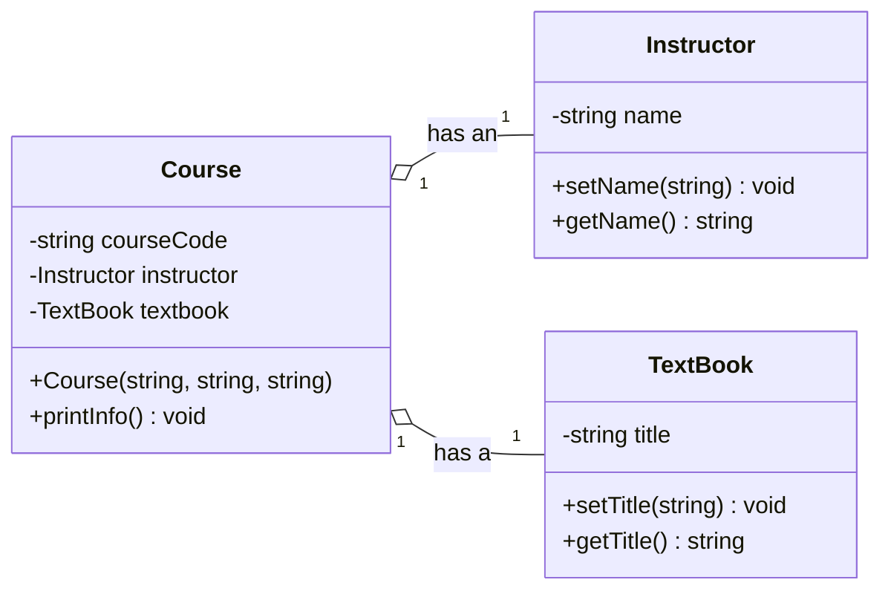

# Semana 4 — Object-Oriented Programming, Parte 2: More About Classes
## COEN 2220 — Programming 2

**Instructor:** Wilson Lozano

**Duración:** 170 min (sesión de 3 horas crédito nominales)
**Precede a:** Lab 4 — OOP, parte 2 (inheritance y polymorphism)
**Lectura complementaria:** Gaddis, *Starting Out with C++*, 8va ed., Cap. 14 — secciones 14.1, 14.3–14.5, 14.7 y conexión conceptual con 14.8 (Instance and Static Members; Memberwise Assignment; Copy Constructors; Operator Overloading; Aggregation; Class Collaborations).

---

## Objetivos

Al finalizar esta sesión, el estudiante podrá:

1. Distinguir entre member variables propias de cada objeto y datos compartidos mediante `static` data members.
2. Declarar y usar `static` member functions respetando qué datos pueden acceder.
3. Modelar una relación de aggregation usando objetos de una clase como members de otra y explicar la relación “has-a”.
4. Explicar cuándo se invoca un copy constructor y qué información copia.
5. Implementar sobrecargas básicas de `+` y `==` cuando representan operaciones naturales para una clase.
6. Relacionar estas decisiones de diseño con las clases que construirán en el proyecto y con estructuras de datos posteriores.

## Parte 0 — Puente: una clase no vive aislada (10 min)

En la sesión anterior construyeron `Book` y `Student`: cada objeto tenía sus propios datos privados y una interfaz pública. Hoy vamos a responder tres preguntas que aparecen cuando el programa deja de tener un solo objeto:

1. ¿Qué información debe compartir **toda** la clase?
2. ¿Cómo puede una clase organizar datos relacionados usando objetos de otras clases?
3. ¿Qué significa realmente copiar un objeto?

### Repaso necesario: encapsulación

Antes de continuar, retomemos una idea de la Semana 3: **encapsulation** es reunir los datos y las operaciones que los manejan dentro de una clase, proteger el estado interno con `private` y ofrecer solamente las operaciones necesarias mediante `public`.

Por ejemplo, una clase `Book` puede guardar `title` como dato `private` y ofrecer `getTitle()` como operación `public`. El resto del programa puede pedir el título, pero no alterar directamente el estado interno sin que la clase lo permita. Esta separación protege reglas del objeto —por ejemplo, que un identificador o un precio sea válido— y reduce las partes del programa que necesitan conocer sus detalles internos.

En esta lecture verán encapsulación aplicada de dos maneras: `static` controla qué información pertenece a toda la clase, y aggregation hace que una clase use la interfaz pública de los objetos que contiene. Dediquen aproximadamente 3 de los 10 minutos de esta parte a este repaso.

También veremos una forma de hacer que expresiones con objetos se lean de modo natural. La meta no es usar sintaxis "ingeniosa", sino mantener las reglas del objeto claras.

## Parte 1 — Datos compartidos: `static` data members (25 min)

Una member variable normal pertenece a **un objeto específico**. Si crean tres objetos `Book`, cada uno tiene su propio `title`, `author` e `isbn`.

En cambio, un `static` data member pertenece a la **clase completa**: existe una sola copia, compartida por todos los objetos. Es apropiado para datos como un contador de objetos creados o una regla común de la clase.

```cpp
#include <iostream>
#include <string>
using namespace std;

class Book
{
    private:
        string title;          // Each Book object keeps its own title.
        int id;                // Each Book object receives a distinct ID.
        static int nextId;     // One shared counter for the entire class.

    public:
        Book(string t) {
            title = t;
            id = nextId;       // Save the current shared value in this object.
            nextId++;          // Reserve the next ID for a future Book.
        }

        string getTitle() const { return title; }
        int getId() const { return id; }
};

int Book::nextId = 1000;       // Define and initialize the single shared counter.

int main() {
    Book firstBook("Algorithms");           // Receives ID 1000.
    Book secondBook("Clean Architecture");  // Receives ID 1001.

    cout << firstBook.getTitle() << ": " << firstBook.getId() << endl;
    cout << secondBook.getTitle() << ": " << secondBook.getId() << endl;

    return 0;
}
```

`nextId` se declara dentro de la clase para comunicar que pertenece a `Book`, pero se define una vez fuera de ella:

```cpp
int Book::nextId = 1000;       // This definition creates the shared storage.
```

Esa definición crea el único contador real y decide su valor inicial. Cada constructor toma el valor actual para su objeto y luego incrementa el contador compartido.

**Traza en clase:** si se crea un tercer objeto, ¿qué valor recibirá? ¿Cambiará el `id` ya guardado en `firstBook`?

<details>
<summary>Ver respuesta</summary>

El tercer objeto recibe `1002`. El `id` de `firstBook` sigue siendo `1000`: `id` no es `static`, así que cada objeto conserva su propia copia. Solo `nextId` es compartido.

</details>

> ⚠️ Un contador `static` describe información de la clase, no una manera de evitar diseñar identificadores correctamente. Si el programa se reinicia, este contador también reinicia. Más adelante, un programa que necesite identificadores permanentes tendría que guardarlos en un archivo o una base de datos.

## Parte 2 — `static` member functions (15 min)

Una `static` member function se puede usar sin tener un objeto particular. Por eso es útil para consultar o modificar información compartida:

```cpp
class Book
{
    private:
        static int nextId;

    public:
        static int getNextId() {
            return nextId;     // A static function can access static data directly.
        }
};

int Book::nextId = 1000;

int main() {
    // No Book object is needed for a class-level operation.
    cout << "Next ID: " << Book::getNextId() << endl;
    return 0;
}
```

Se llama con el nombre de la clase: `Book::getNextId()`. Una función `static` puede acceder directamente a otros miembros `static`, pero **no** a un member variable normal: no existe un objeto implícito que le diga cuál `title` o cuál `id` debe usar.

**Ejercicio en clase:** ¿por qué esta función no compila si `title` no es `static`?

```cpp
static string getTitle() {
    return title;  // ERROR: no specific Book object owns this title.
}
```

<details>
<summary>Ver respuesta</summary>

`title` pertenece a un objeto específico, pero `getTitle()` se puede llamar como `Book::getTitle()` sin crear ningún `Book`. El compilador no puede decidir de cuál objeto debe obtener el título. Un getter de un dato individual debe ser una función miembro normal y llamarse sobre un objeto, por ejemplo `firstBook.getTitle()`.

</details>

## Parte 3 — Aggregation: una clase tiene objetos de otra (25 min)

Hasta ahora `Book` y `Student` eran clases independientes. En un sistema real, una clase a veces necesita incluir objetos de otras clases como parte de sus propios datos. En este capítulo, el libro llama **aggregation** a esa relación: una clase contiene una instancia de otra clase como member variable.

Un `Course` no debe guardar mezclados el nombre del instructor, su oficina, el título del libro y su editorial como strings sueltos. Esos grupos de datos tienen sentido como sus propias clases: `Instructor` y `TextBook`. Entonces `Course` los usa como members:

```cpp
#include <iostream>
#include <string>
using namespace std;

class Instructor
{
    private:
        string name;            // Data that belongs to one Instructor object.

    public:
        Instructor() { name = ""; }  // Start with a valid empty value.
        void setName(string n) { name = n; }
        string getName() const { return name; }
};

class TextBook
{
    private:
        string title;           // Data that belongs to one TextBook object.

    public:
        TextBook() { title = ""; }  // Start with a valid empty value.
        void setTitle(string t) { title = t; }
        string getTitle() const { return title; }
};

class Course
{
    private:
        string courseCode;
        Instructor instructor;  // Course has an Instructor object.
        TextBook textbook;      // Course has a TextBook object.

    public:
        Course(string code, string instructorName, string bookTitle) {
            courseCode = code;
            instructor.setName(instructorName);  // Use Instructor's public interface.
            textbook.setTitle(bookTitle);        // Keep TextBook data encapsulated.
        }

        void printInfo() const {
            cout << "Course: " << courseCode << endl;
            cout << "Instructor: " << instructor.getName() << endl;
            cout << "Textbook: " << textbook.getTitle() << endl;
        }
};

int main() {
    // One Course object contains both related objects.
    Course programming2("COEN 2220", "Wilson Lozano",
                        "Starting Out with C++");
    programming2.printInfo();  // Course asks each member object for its data.

    return 0;
}
```

Decimos que `Course` **has an** `Instructor` y **has a** `TextBook`. Esa expresión “has-a” ayuda a reconocer aggregation: el objeto completo se compone de objetos relacionados y cada clase mantiene su propia responsabilidad.

Esto conserva la encapsulación. `Course` no toca directamente `Instructor::name` ni `TextBook::title`; solicita los datos mediante sus interfaces públicas.

**Ejercicio en clase:** para un sistema de biblioteca, propongan una clase que contenga un `Book` y un `Student` como members. ¿Cuál es su responsabilidad y cuál sería un buen nombre para esa clase?

<details>
<summary>Ver una posible respuesta</summary>

Una clase `Loan` podría tener un `Book`, un `Student` y una fecha de préstamo. Su responsabilidad sería representar una transacción de préstamo. `Book` sigue concentrándose en la información del libro y `Student` en la información del estudiante; `Loan` concentra la relación entre ambos.

</details>

En un diagrama UML, la aggregation se representa con una línea y un diamante abierto junto a la clase que representa el todo. Por ahora, la idea clave es reconocer y justificar la relación “has-a”; usarán ese razonamiento de nuevo al diseñar su proyecto.

El siguiente diagrama representa exactamente las tres clases del ejemplo. El diamante abierto junto a `Course` indica que `Course` es el todo que agrega los objetos `Instructor` y `TextBook`:



No memoricen todavía toda la notación UML. Lean el diagrama como una versión visual de la declaración de `Course`: sus members `instructor` y `textbook` son objetos de otras clases, no strings sin estructura.

## Parte 4 — Copiar objetos: memberwise assignment y copy constructors (30 min)

Copiar un objeto parece simple:

```cpp
Book original("Algorithms");  // The source object already exists.
Book copy = original;          // A new object is initialized from original.
```

La primera línea crea el objeto `original`. La segunda línea crea **otro objeto nuevo**, llamado `copy`, y lo inicializa con los valores de `original`. Aunque aparece el símbolo `=`, esto **no** es una asignación: `copy` todavía no existía. Por eso C++ llama un **copy constructor**.

Si la clase no define su propio copy constructor, C++ genera uno por default que copia cada member variable de `original` al nuevo objeto `copy`.

El comportamiento por default es suficiente para una clase con tipos simples como `string`, `int` o `double`. Podemos escribir una versión explícita para observar qué recibe:

```cpp
class Book
{
    private:
        string title;           // string can be copied safely by its own constructor.
        int id;                 // int can also be copied member by member.

    public:
        Book(string t, int bookId) {
            title = t;
            id = bookId;
        }

        Book(const Book &other) {
            title = other.title;  // Copy the source object's title.
            id = other.id;        // Copy the source object's ID.
        }

        string getTitle() const { return title; }
        int getId() const { return id; }
};
```

`const Book &other` evita crear otra copia solo para pasar el argumento y garantiza que el constructor no modificará el objeto original.

El copy constructor se usa en situaciones como estas:

```cpp
Book original("Algorithms", 1000);
Book copy = original;            // Copy initialization calls the copy constructor.
Book anotherCopy(original);       // Direct initialization does too.
```

> 🔑 **Distinción clave:** ambos casos copian datos, pero ocurren en momentos distintos. Antes de continuar, compárenlos directamente:

| Pregunta | Copy construction | Memberwise assignment |
|---|---|---|
| ¿El objeto de la izquierda ya existe? | No | Sí |
| Ejemplo | `Book copy = original;` | `copy = original;` |
| Qué ocurre | Se construye un objeto nuevo con los valores de `original`. | Se reemplazan los valores de un objeto ya creado con los de `original`. |
| Operación involucrada | Copy constructor | Assignment operator; por default, copia member por member. |

La apariencia del símbolo `=` puede engañar: en la primera expresión forma parte de la **inicialización** de una declaración; en la segunda es una **asignación** entre dos objetos que ya existen.

También se invoca cuando un objeto se pasa **por valor** a una función, porque el parámetro es un objeto nuevo inicializado con el argumento:

```cpp
void printBook(Book book) {       // Passing by value constructs a parameter copy.
    cout << book.getTitle() << endl;
}
```

En la mayoría de los casos, prefieran `const Book &book` para evitar esa copia y dejar claro que la función solo leerá el objeto.

En cambio, esta línea usa el assignment operator: `copy` ya existía.

```cpp
copy = original;                  // copy already exists, so this is assignment.
```

Esta asignación copia los members de `original` a `copy`; el libro llama a ese comportamiento **memberwise assignment**. Por ahora ambos mecanismos pueden terminar con resultados parecidos, pero no son la misma operación: uno **construye** un objeto nuevo; el otro **modifica** uno existente.

**Ejercicio en clase:** predigan la salida.

```cpp
Book firstBook("Algorithms", 1000);
Book secondBook = firstBook;      // secondBook receives copied member values.

cout << secondBook.getTitle() << " " << secondBook.getId() << endl;
```

<details>
<summary>Ver respuesta</summary>

Imprime `Algorithms 1000`. El copy constructor copia los miembros de `firstBook` a `secondBook`.

</details>

> ⚠️ Esta copia simple deja de ser segura si una clase administra memoria dinámica con raw pointers. Copiar solo una dirección puede provocar que dos objetos intenten liberar la misma memoria. Cuando implementen estructuras enlazadas, volveremos a este problema y a la necesidad de definir cuidadosamente las operaciones de copia.

El mismo problema aparece al asignar sobre un objeto que ya existe. El libro desarrolla la sobrecarga de `operator=` para ese caso; hoy no la implementaremos porque requiere dedicar tiempo a la copia profunda y a la gestión de memoria. Por ahora, deben poder identificar por qué una clase con un raw pointer no puede depender de la copia automática.

## Parte 5 — Operator overloading con intención clara (30 min)

Los operadores ya son funciones con una sintaxis especial. Por ejemplo, `3 + 4` representa una operación de suma. C++ permite definir qué significa un operador para una clase, pero solo deben hacerlo cuando la lectura sea natural y no esconda una operación sorprendente.

Supongan una aplicación sencilla que registra cuánto tiempo un estudiante dedica a actividades distintas. Cada objeto `StudyTime` guarda una duración en minutos: por ejemplo, 45 minutos de lectura o 30 minutos de práctica.

En ese contexto, sumar dos duraciones tiene un significado claro: `reading + practice` debe producir una duración total de 75 minutos. Comparar dos duraciones también es natural: dos objetos son iguales si guardan la misma cantidad de minutos. Por eso `StudyTime` es una buena clase pequeña para practicar `operator+` y `operator==`:

```cpp
#include <iostream>
using namespace std;

class StudyTime
{
    private:
        int minutes;               // Each StudyTime object stores its own duration.

    public:
        StudyTime(int m = 0) {
            minutes = m;
        }

        StudyTime operator+(const StudyTime &other) const {
            // Return a new object; do not modify either operand.
            return StudyTime(minutes + other.minutes);
        }

        bool operator==(const StudyTime &other) const {
            return minutes == other.minutes;  // Compare the class's meaningful value.
        }

        int getMinutes() const { return minutes; }
};

int main() {
    StudyTime reading(45);
    StudyTime practice(30);
    StudyTime total = reading + practice;  // Calls reading.operator+(practice).

    cout << "Total: " << total.getMinutes() << " minutes" << endl;
    cout << boolalpha << (total == StudyTime(75)) << endl;  // Calls operator==.

    return 0;
}
```

`reading + practice` se traduce conceptualmente a una llamada sobre `reading`, con `practice` como argumento. El método no modifica ninguno de los dos objetos: construye y devuelve un nuevo `StudyTime`.

La palabra `const` aparece dos veces por razones distintas:

- En `const StudyTime &other`, protege el argumento recibido.
- Después de los paréntesis, protege el objeto que recibe la llamada (`reading` o `total`).

**Ejercicio en clase:** ¿por qué esta sobrecarga sería confusa?

```cpp
StudyTime operator+(const StudyTime &other) const {
    return StudyTime(minutes * other.minutes);  // Misleading: + should not multiply.
}
```

<details>
<summary>Ver respuesta</summary>

El operador `+` comunica suma. Hacer que multiplique sorprendería a quien lee el código y produciría programas difíciles de entender. Operator overloading debe conservar una expectativa razonable del operador original.

</details>

No vamos a usar `friend` como parte del diseño de esta guía. Puede permitir que una función externa acceda a miembros privados, pero casi siempre una interfaz pública bien diseñada —como `getMinutes()`— expresa mejor la colaboración y protege la encapsulación.

## Parte 6 — Integración: diseñar antes de escribir (10 min)

En parejas, diseñen una clase `CourseSection` para representar una sección de curso. No escriban todavía un programa completo. Respondan primero:

1. ¿Qué dato de todos los objetos `CourseSection` debería ser `static`? Piensen en un máximo compartido de estudiantes o un contador de secciones creadas.
2. ¿Qué otra clase podría agregarse sin que `CourseSection` sea dueña de su vida? Piensen en `Student`.
3. ¿Qué operador, si alguno, tendría un significado claro? Por ejemplo, ¿tiene sentido `==` entre dos secciones? Definan qué compararía.
4. Si se copia una sección, ¿qué datos esperarán que queden iguales? ¿Cuáles tal vez deberían recibir un valor nuevo?

No hay una única solución. Lo importante es que su decisión identifique explícitamente la relación “has-a”, el estado compartido y el significado de las operaciones antes de empezar a programar.

Este ejercicio es una introducción ligera a **class collaborations**: una clase no se diseña solo por sus atributos, sino también por la responsabilidad que asume al trabajar con otras clases. En el Lab 5 usarán esa idea al proponer el diseño de su proyecto; allí podrán organizarla con CRC cards si el tiempo del kickoff lo permite.

## Parte 7 — Discusión y colchón (15 min)

Usen este tiempo para revisar la traza de los ejemplos, compilar variantes o responder dudas. Si el ritmo de la clase lo permite, revisen una propuesta de `CourseSection` y justifiquen en voz alta una de sus decisiones de diseño.

La prioridad es consolidar los conceptos centrales de hoy; no se añade contenido nuevo en este bloque.

## Parte 8 — Resumen y próxima sesión (10 min)

### Resumen de la sesión

- Un `static` data member pertenece a la clase y se comparte entre todos sus objetos.
- Una `static` member function trabaja con información de clase; no tiene un objeto individual implícito.
- Aggregation modela una relación “has-a”: una clase puede contener objetos de otras clases como parte de sus members.
- Un copy constructor construye una copia nueva; assignment modifica un objeto que ya existe.
- Operator overloading debe representar una operación clara y esperable para el dominio del objeto.

Estas decisiones preparan el terreno para inheritance y polymorphism: antes de extender o sustituir clases, hay que entender qué datos comparten, cómo colaboran y cómo se copian.

### Próxima sesión

**Lab 4 — OOP, parte 2.** Aplicarán estas ideas al diseño de clases antes de comenzar inheritance y polymorphism en la siguiente unidad de OOP.
