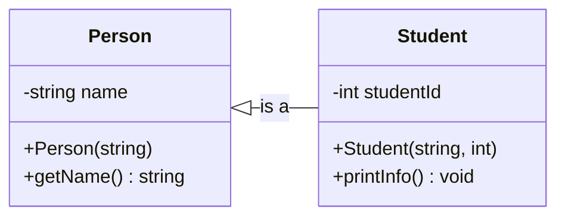

# Semana 5 — Object-Oriented Programming, Parte 3: Inheritance, Polymorphism, and Templates Introduction
## COEN 2220 — Programming 2

**Instructor:** Wilson Lozano

**Duración:** 170 min (sesión de 3 horas crédito nominales)
**Precede a:** Lab 5 — Project Kickoff
**Lectura complementaria:** Gaddis, *Starting Out with C++*, 8va ed., Cap. 15 — secciones 15.1–15.7 (Inheritance; Base and Derived Classes; Constructors and Destructors; Redefining Member Functions; Class Hierarchies; Polymorphism and Virtual Member Functions; Abstract Base Classes); Cap. 16 — secciones 16.2–16.4 (Function Templates; When to Start When Defining Templates; Class Templates, vista preliminar).

---

## Objetivos

Al finalizar esta sesión, el estudiante podrá:

1. Identificar una relación “is-a” y representarla mediante una base class y una derived class con `public` inheritance.
2. Explicar cómo se construyen y destruyen los objetos dentro de una jerarquía simple.
3. Distinguir con precisión entre function overloading, overriding y polymorphism.
4. Usar `virtual`, `override` y un base-class pointer o reference para obtener dynamic binding.
5. Reconocer cuándo una abstract base class expresa una interfaz común.
6. Convertir una función regular en una function template e identificar las operaciones que el tipo genérico debe soportar.

## Parte A — Puente: de “has-a” a “is-a” (10 min)

En la Semana 4, `Course` **has an** `Instructor`: era una relación de aggregation. Hoy aparece otra pregunta de diseño: ¿una clase nueva **contiene** otra clase o es una versión más específica de ella?

Un `Student` **is a** `Person`. Comparte información y comportamientos generales de una persona, pero también añade datos propios, como un student ID. Esa es una buena razón para usar inheritance. En cambio, un `Student` **has a** `CourseSchedule`; eso sigue siendo aggregation.

> 🔑 Usen inheritance solamente cuando la frase “derived object **is a** base object” sea verdadera y útil. No es una técnica para reutilizar código sin considerar el significado del modelo.

## Parte B — Base y derived classes: reutilizar una responsabilidad común (20 min)

Imaginen que un programa del curso necesita guardar información de personas: todas tienen un nombre, pero solo los estudiantes necesitan además un student ID. Una primera alternativa sería repetir `name` en una clase `Person` y otra clase `Student`. Esa repetición crea un problema: si cambia la manera de representar o validar un nombre, habría que corregirla en varias clases.

**Inheritance** es el mecanismo de C++ que permite crear una clase nueva a partir de otra clase existente cuando comparten una relación real de especialización. La clase existente y más general se llama **base class**; la clase nueva, que hereda y puede añadir responsabilidades, se llama **derived class**. Con `public` inheritance, un `Student` puede usarse donde el programa necesita una `Person`, porque todo `Student` también es una `Person`.

El siguiente ejemplo modela exactamente ese escenario. La clase `Person` concentra el dato común (`name`) y su interfaz pública. La clase `Student` hereda esa parte, añade el member variable `studentId` y reutiliza la función `getName()` para imprimir la información completa. Más adelante crearemos una instancia de la clase `Student`, llamada `learner`; ese objeto tendrá tanto la parte `Person` como los datos añadidos por `Student`.

En la línea `class Student : public Person`, `Student` es el nombre de la derived class; los dos puntos introducen la lista de clases de las que hereda; y `public Person` declara que la clase base es `Person` y que la herencia es pública. La palabra `public` preserva la relación “is-a”: cualquier objeto `Student` puede tratarse como un objeto `Person` cuando el programa necesita solamente las operaciones públicas de `Person`. No significa que los datos `private` de la clase `Person` se vuelvan accesibles directamente desde `Student`.

> **Nota — `private` inheritance:** C++ también permite escribir `class Student : private Person`. En ese caso, `Student` puede reutilizar la implementación de `Person` internamente, pero las operaciones `public` de `Person` dejan de ser accesibles para quien use un objeto `Student`. Por ejemplo, `learner.getName()` no sería válido desde `main`. Por eso `private` inheritance no expresa “Student is a Person”; expresa más bien “Student is implemented using Person”. Puede ser útil para reutilizar una implementación y ocultar su interfaz, aunque composition suele comunicar esa intención con mayor claridad. En esta unidad usaremos `public` inheritance cuando la relación de diseño sea realmente “is-a”.

El constructor `Student(string personName, int id) : Person(personName)` usa una **member initializer list**. La parte después de los dos puntos llama al constructor de la clase base `Person` antes de ejecutar el cuerpo del constructor de `Student`. Así, la parte base del objeto recibe su nombre mediante el constructor que ya controla ese dato.

```cpp
#include <iostream>
#include <string>
using namespace std;

class Person
{
    private:
        string name;  // Each Person controls its own name.

    public:
        Person(string personName) {
            name = personName;  // Initialize the shared state once in the base class.
        }

        string getName() const {
            return name;        // Derived classes can use this public interface.
        }
};

class Student : public Person
{
    private:
        int studentId;          // This detail belongs only to Student.

    public:
        Student(string personName, int id) : Person(personName) {
            // Call Person's constructor before initializing Student-specific data.
            studentId = id;     // Initialize the state added by Student.
        }

        void printInfo() const {
            cout << getName() << " has ID " << studentId << endl;
        }
};

int main() {
    Student learner("Jordan Lee", 24017);
    learner.printInfo();
    return 0;
}
```

`Student : public Person` no copia las variables de `Person` dentro de `Student`; el objeto `Student` incluye una parte base `Person` y añade su propio estado. La member variable `name` sigue siendo `private`: `Student` debe usar `getName()` en vez de acceder a ella directamente. Esto mantiene la encapsulación que reforzaron la semana pasada.



**Ejercicio en clase:** ¿`Course` debería heredar de `Instructor` porque usa un instructor? ¿Por qué?

<details>
<summary>Ver respuesta</summary>

No. Un `Course` no es un `Instructor`; un `Course` tiene un `Instructor`. Por eso la relación de la Semana 4 es aggregation, no inheritance.

</details>

## Parte C — Constructores, destructores y acceso (15 min)

En la Parte B, una instancia de `Student` contenía una parte construida por la clase base `Person` y una parte propia de la clase derived `Student`. Antes de que `Student` pueda usar su propio estado, la parte `Person` debe existir y estar inicializada. C++ impone ese orden para que una derived class nunca dependa de una base class incompleta.

Un **constructor** es la función especial que inicializa un objeto cuando se crea. Un **destructor** es la función especial que se ejecuta cuando el objeto deja de existir. En una jerarquía de herencia, C++ construye primero la parte base y luego la parte derived. Durante la destrucción hace lo contrario: destruye primero la parte derived y finalmente la parte base. Por eso el constructor de la clase `Student` usa `: Person(personName)`: entrega al constructor de la clase base la información que este necesita.

El siguiente programa completo crea una instancia de la clase `Student`, llamada `learner`, para observar el orden mediante mensajes impresos. Al ejecutarlo, primero deben ver el mensaje del constructor de `Person`, después el del constructor de `Student`, y al terminar `main` los mensajes de los destructores en orden inverso.

```cpp
#include <iostream>
#include <string>
using namespace std;

class Person
{
    public:
        Person(string personName) {
            cout << "Person constructor for " << personName << endl;
        }

        ~Person() {
            cout << "Person destructor" << endl;  // Runs after the derived destructor.
        }
};

class Student : public Person
{
    public:
        Student(string personName) : Person(personName) {
            cout << "Student constructor" << endl; // Runs after Person is ready.
        }

        ~Student() {
            cout << "Student destructor" << endl;  // Runs before the Person destructor.
        }
};

int main() {
    Student learner("Jordan Lee"); // Construct one object with a Person base part.
    return 0;                       // learner is destroyed as main ends.
}
```

**Qué deberías ver:**

```text
Person constructor for Jordan Lee
Student constructor
Student destructor
Person destructor
```

El objeto `learner` deja de existir al terminar `main`. Por eso sus destructores se ejecutan después de `return 0`, primero el de la clase más específica (`Student`) y luego el de la clase base (`Person`).

> **Nota — constructor initializer list:** la lista que sigue a los parámetros de un constructor puede inicializar **dos cosas distintas antes de ejecutar el cuerpo `{ ... }`**: la parte base del objeto y los member variables del objeto. La sintaxis es parecida, pero el nombre a la izquierda indica qué se inicializa:
>
> ```cpp
> Student(string personName, int id)
>     : Person(personName), // Initialize the base-class part by calling Person's constructor.
>       studentId(id) {     // Initialize Student's member variable directly.
> ```
>
> `Person(personName)` es un **base-class initializer**: llama al constructor de la clase base `Person` para construir la parte `Person` de un nuevo objeto `Student`. `Person` no es un member variable de `Student`.
>
> `studentId(id)` es un **member initializer**: inicializa el member variable `studentId` con el valor del parámetro `id`. De forma similar, si una clase tuviera un member variable `passed`, una entrada como `passed(didPass)` inicializaría ese member; no llamaría un método.
>
> Ambas entradas pertenecen a la misma constructor initializer list y ocurren antes del cuerpo del constructor. Para datos simples de los ejemplos iniciales, también es válido y más fácil de leer asignar dentro del cuerpo, como `studentId = id;`. La inicialización de la clase base sí debe aparecer en esta lista cuando su constructor necesita argumentos.

La palabra `private` limita el acceso a la clase que declara el dato; `public` permite que el resto del programa use una operación como parte de la interfaz. Existe además `protected`: permite acceso a la clase que declara el member y a sus derived classes, pero no a `main` ni a otras clases no relacionadas. Para esta unidad, mantengan los datos en `private` y expongan operaciones públicas intencionales. `protected` no es una invitación a que cualquier derived class modifique el estado de la base; úselo solo cuando la clase base diseñe explícitamente ese punto de extensión.

## Parte D — Tres ideas que no son lo mismo (15 min)

Al comenzar OOP, es común escuchar “polymorphism” para cualquier situación donde varias funciones tienen nombres parecidos. Antes de ver más código, separemos tres mecanismos diferentes. Los tres se relacionan con funciones, pero responden a preguntas distintas:

| Concepto | Idea central | Cuándo decide C++ | Ejemplo |
| --- | --- | --- | --- |
| **Overloading** | El nombre de una función se repite, pero la lista de parámetros cambia. | Compile time, al leer los argumentos. | `print(int)` y `print(string)` |
| **Overriding** | Una derived class escribe su propia versión de una función `virtual` heredada, con la misma firma. | La derived class define la versión disponible para sus objetos. | La clase `Student` define `describe()` para reemplazar `Person::describe()`. |
| **Polymorphism** | El programa usa una reference o pointer de la base para llamar una operación; C++ ejecuta la versión del objeto real. | Runtime, mediante una función `virtual`. | Una `Person &` que se refiere a un `Student` llama `Student::describe()`. |

**Function overloading** significa que una misma función tiene varias versiones diferenciadas por sus parámetros. Por ejemplo, al encontrar `print(4)`, el compilador elige `print(int)` porque conoce el tipo del argumento antes de ejecutar el programa.

**Overriding** ocurre en una jerarquía de inheritance. Primero, la clase `Person` declara una función `virtual` llamada `describe()`. Después, la clase `Student` escribe otra `describe()` con la misma firma, pero adaptada a estudiantes. Por ahora, piensen en overriding como “la derived class reemplaza una versión heredada”.

**Polymorphism dinámico** usa ese overriding desde una perspectiva distinta: el programa no necesita preguntar si tiene un `Person` o un `Student` antes de llamar `describe()`. Si una reference de la clase `Person` se refiere realmente a un objeto de la clase `Student`, la llamada ejecuta la versión de `Student`. La Parte E construirá y ejecutará ese caso paso a paso.

Overloading no necesita inheritance y no es polymorphism dinámico. Overriding prepara el comportamiento alterno en la derived class; polymorphism dinámico aparece cuando se llama una función `virtual` mediante una base pointer o reference.

**Pregunta de verificación:** si `print(int)` y `print(double)` existen, ¿cuál se llama en `print(4)`?

<details>
<summary>Ver respuesta</summary>

Se llama `print(int)`. El compilador conoce el tipo de `4` antes de ejecutar el programa; esa selección es overloading en compile time.

</details>

## Parte E — Polymorphism: `virtual`, `override` y dynamic binding (25 min)

Para construir el ejemplo, imaginemos un programa pequeño que registra las evaluaciones de un curso. En este programa, una **activity** es cualquier elemento evaluado —por ejemplo, un examen o una verificación de seguridad del laboratorio— y cada activity tiene un título. El programa necesita mostrar una descripción de cada activity en un reporte.

No todas las activities se reportan de la misma manera. Un examen numérico puede mostrar su título y que se califica numéricamente; una verificación pass/fail debe comunicar si se aprobó o no. Si el programa guarda ambas como activities, necesita una manera de pedir una descripción sin decidir primero la clase concreta de cada objeto.

Este escenario sugiere una jerarquía pequeña: la clase `Activity` será la **base class**, porque representa lo común a toda evaluación; la clase `PassFailActivity` será una **derived class**, porque representa el caso particular que necesita guardar si se aprobó. Para mantener este primer ejemplo corto, una evaluación numérica se representará con una instancia directa de `Activity`, cuya descripción por default ya es adecuada. En un sistema más grande podríamos crear también una derived class `NumericActivity` si necesitara datos o reglas propias.

**Polymorphism** significa que el programa puede usar una operación común, como `describe()`, y C++ decide cuál versión ejecutar según el objeto real. Para llegar a esa idea, construyamos el ejemplo en cuatro pasos.

### Paso 1 — Declarar la operación común

La clase base `Activity` representa lo que todas las evaluaciones tienen en común: un título y la posibilidad de describirse. La palabra `virtual` antes de `describe()` le dice a C++: “una derived class puede proporcionar otra versión de esta operación; si una llamada se hace mediante una base pointer o reference, elige la versión del objeto real”.

```cpp
class Activity
{
    private:
        string title; // Each activity keeps its own title.

    public:
        Activity(string activityTitle) : title(activityTitle) {
        }

        virtual void describe() const {
            cout << title << ": graded numerically" << endl;
        }
};
```

Por ahora, una instancia directa de la clase `Activity` usaría esa descripción numérica por default. El método sigue siendo una función miembro normal: si tenemos un objeto llamado `exam`, podemos escribir `exam.describe()` usando el operador `.` que ya conocen.

### Paso 2 — Crear una versión especializada

La clase `PassFailActivity` representa una activity cuya regla es distinta. Hereda de `Activity`, agrega el member variable `passed` y escribe su propia versión de `describe()`. La firma debe ser la misma: `void describe() const`. La palabra `override` hace que el compilador reporte un error si por accidente escribimos una firma diferente y no estamos realmente reemplazando la función virtual de la base.

El constructor usa `: Activity(activityTitle)` para construir primero la parte base, tal como se explicó en la Parte C. Después, dentro de las llaves, asigna el parámetro `didPass` al member variable `passed`. Conservamos esa asignación explícita porque es fácil de seguir en este primer ejemplo.

```cpp
class PassFailActivity : public Activity
{
    private:
        bool passed; // This state exists only for pass/fail activities.

    public:
        PassFailActivity(string activityTitle, bool didPass)
            : Activity(activityTitle) { // Initialize the inherited Activity part.
            passed = didPass;           // Store the pass/fail result in this object.
        }

        void describe() const override {
            if (passed) {
                cout << "Passed" << endl;
            } else {
                cout << "Not passed" << endl;
            }
        }
};
```

Si se usa directamente una instancia de `PassFailActivity`, la llamada es sencilla y no requiere polymorphism todavía:

```cpp
PassFailActivity safety("Lab Safety Check", true);
safety.describe(); // Calls PassFailActivity::describe().
```

La salida es `Passed` porque `safety` es claramente un objeto de la clase `PassFailActivity` y usamos `.` para llamar una función sobre el objeto.

### Paso 3 — Usar una base pointer

Ahora viene la parte importante. Una **pointer** guarda una dirección de memoria, no el objeto mismo. En la declaración `Activity *current`, el `*` indica que `current` será una pointer que puede apuntar a un objeto `Activity`. Como un `PassFailActivity` **is an** `Activity`, esa pointer también puede guardar la dirección de un objeto `PassFailActivity`:

```cpp
Activity *current = &safety;
current->describe();
```

El operador `&` obtiene la dirección del objeto `safety`. No crea una copia ni memoria dinámica: `current` solo señala al objeto que ya existe. Como `current` es una pointer y no un objeto, no usamos `current.describe()`. El operador `->` significa “seguir la pointer y llamar una función sobre el objeto encontrado”. Esta línea:

```cpp
current->describe();
```

es equivalente a la forma más larga `(*current).describe()`. Los paréntesis son necesarios porque `*current` obtiene el objeto antes de usar `.`. En la práctica, `->` es la forma clara y usual para acceder a un member mediante una pointer.

Aunque `current` tiene tipo `Activity *`, apunta al objeto `safety`, que realmente es `PassFailActivity`. Como `describe()` fue declarada `virtual`, C++ ejecuta `PassFailActivity::describe()`, no `Activity::describe()`. Esa selección durante la ejecución se llama **dynamic binding**; este es el polymorphism que queremos observar.

### Paso 4 — Programa completo para ejecutar

El siguiente programa reúne los pasos anteriores. Crea dos objetos: `numeric`, de la clase base `Activity`, y `safety`, de la derived class `PassFailActivity`. Luego los dos se observan mediante variables de tipo `Activity *`. Comparen las dos llamadas finales: tienen la misma sintaxis, pero producen descripciones diferentes porque señalan a objetos reales de clases distintas.

```cpp
#include <iostream>
#include <string>
using namespace std;

class Activity
{
    private:
        string title;

    public:
        Activity(string activityTitle) {
            title = activityTitle;
        }

        virtual void describe() const {
            cout << title << ": graded numerically" << endl;
        }
};

class PassFailActivity : public Activity
{
    private:
        bool passed;

    public:
        PassFailActivity(string activityTitle, bool didPass)
            : Activity(activityTitle) { // Initialize the inherited Activity part.
            passed = didPass;           // Store the pass/fail result in this object.
        }

        void describe() const override {
            if (passed) {
                cout << "Passed" << endl;
            } else {
                cout << "Not passed" << endl;
            }
        }
};

int main() {
    Activity numeric("Programming Exam");
    PassFailActivity safety("Lab Safety Check", true);

    Activity *firstActivity = &numeric;   // Store the address of an Activity object.
    Activity *secondActivity = &safety;   // A base pointer can point to a derived object.

    firstActivity->describe();  // Calls Activity::describe().
    secondActivity->describe(); // Calls PassFailActivity::describe() because describe is virtual.

    return 0;
}
```

**Qué deberías ver:**

```text
Programming Exam: graded numerically
Passed
```

Sin `virtual`, la segunda llamada usaría la versión que corresponde al tipo de la pointer (`Activity *`), aun cuando la pointer señale un `PassFailActivity`. Con `virtual`, C++ conserva la información del objeto real y realiza dynamic binding. Usen `override` siempre que una derived class sobrescriba una función virtual: convierte un error de escritura en un error claro del compilador.

**Traza en clase:** ¿por qué `secondActivity->describe()` imprime `Passed` aunque `secondActivity` fue declarada como `Activity *`?

<details>
<summary>Ver respuesta</summary>

La pointer es de tipo `Activity *`, pero el objeto al que apunta es un `PassFailActivity`. Como `describe()` es `virtual`, C++ selecciona la versión overridden de la derived class: `PassFailActivity::describe()`.

</details>

## Parte F — Abstract base classes: una interfaz, varias implementaciones (15 min)

Este es un **nuevo ejemplo independiente** del programa de `Activity` de la Parte E. No añadiremos `isPassing()` a `Activity`, ni `GradeRule` hereda de `Activity`. Ahora modelaremos una política que un curso puede usar para decidir si un puntaje es aprobatorio.

Por ejemplo, un curso puede usar una regla de puntaje mínimo: un estudiante aprueba con 70 o más. Otro curso podría usar una regla distinta, como aprobar solamente con una letra específica. Ambas reglas deben poder responder la misma pregunta: “dado este puntaje, ¿aprueba?”. Sin embargo, una regla genérica no sabe cuál umbral o política debe usar.

Una **abstract base class** describe una familia de objetos, pero no se puede usar para crear objetos directamente. Una **pure virtual function** termina en `= 0`. La clase base declara que toda regla debe ofrecer esa operación, pero no define cómo realizarla. Una derived class debe definirla antes de que podamos crear objetos de esa clase. Una clase concreta ya proporciona implementaciones para todas las pure virtual functions heredadas.

En C++, no existe una palabra especial como `abstract` delante de la declaración de una clase. Una clase se vuelve abstracta cuando declara **al menos una** pure virtual function. No hace falta que todas sus funciones `public` sean `virtual`, ni que todas las funciones `virtual` terminen en `= 0`.

Una abstract base class también puede tener data members, constructores y funciones ya implementadas. Por ejemplo, `GradeRule` podría guardar un course code o tener una función normal para devolver ese código. El `= 0` se usa solamente en las operaciones para las que la clase base exige una respuesta de cada derived class, pero no puede dar una respuesta general. Si una derived class no implementa alguna pure virtual function heredada, esa derived class también sigue siendo abstract y tampoco se pueden crear objetos de ella.

El siguiente programa declara `GradeRule` como la interfaz común. La línea `virtual bool isPassing(double score) const = 0;` no contiene cuerpo porque cada regla concreta debe decidir su propia política. El `= 0` convierte a `isPassing` en una pure virtual function y, por esa razón, convierte `GradeRule` en una abstract base class. La clase `MinimumScoreRule` hereda de `GradeRule`, guarda el umbral mínimo y proporciona una implementación específica de `isPassing`.

En `main`, `passingRule` es una instancia concreta de `MinimumScoreRule` con umbral de 70. `finalExamScore` es el dato que queremos evaluar. La pointer `rule` tiene tipo `GradeRule *`, pero guarda la dirección de ese objeto concreto. Esta es la misma idea de la Parte E: `rule->isPassing(finalExamScore)` usa la interfaz común y ejecuta la versión del objeto real.

```cpp
#include <iostream>
using namespace std;

class GradeRule
{
    public:
        virtual bool isPassing(double score) const = 0; // Every concrete rule must define this policy.
};

class MinimumScoreRule : public GradeRule
{
    private:
        double minimumScore; // This rule's threshold, not a student's score.

    public:
        MinimumScoreRule(double requiredScore) {
            minimumScore = requiredScore;
        }

        bool isPassing(double score) const override {
            return score >= minimumScore; // One specific passing policy.
        }
};

int main() {
    MinimumScoreRule passingRule(70.0); // A course rule: at least 70 passes.
    double finalExamScore = 74.0;        // A score evaluated by that rule.
    GradeRule *rule = &passingRule;      // Store passingRule's address in a base-class pointer.

    cout << boolalpha << rule->isPassing(finalExamScore) << endl; // Calls MinimumScoreRule::isPassing.
    return 0;
}
```

**Qué deberías ver:**

```text
true
```

La línea `GradeRule rule;` no compila porque intentaría crear un objeto de la clase abstracta `GradeRule`. Esa clase declara la pregunta `isPassing`, pero no sabe responderla por sí misma. En cambio, `GradeRule *rule` solo declara una pointer: no crea ningún objeto `GradeRule`. En este programa, `rule` guarda la dirección del objeto concreto `passingRule`, que sí es un `MinimumScoreRule` y sí sabe aplicar el umbral de 70.

Por eso otra parte del programa puede usar la misma llamada `rule->isPassing(finalExamScore)` sin necesitar saber los detalles del umbral. Si después el curso adopta otra regla concreta, esa parte del programa puede seguir haciendo la misma pregunta mediante una `GradeRule *`; cambia el objeto-regla, no la llamada que lo usa. No usamos `new` ni `delete` en este ejemplo: la pointer solo observa un objeto local ya creado.

No cubriremos multiple inheritance en este curso. Una jerarquía pequeña, con una responsabilidad clara por clase, es más útil para practicar diseño que una jerarquía complicada.

## Parte G — Integración de OOP: decidir antes de heredar (10 min)

Ahora apliquen el proceso de diseño usado en los ejemplos: primero identificar una responsabilidad común, luego comprobar la relación “is-a” y, solo entonces, decidir si una función necesita `virtual`. En parejas, propongan una familia de dos o tres clases para el proyecto. Antes de escribir código, respondan:

1. ¿Cuál es la base class y qué responsabilidad común posee?
2. Para cada clase propuesta, completen la frase “___ is a ___”. Si no suena verdadera, ¿debería ser aggregation en cambio?
3. ¿Qué operación tiene versiones distintas y justifica una función `virtual`?
4. ¿Qué datos deben seguir `private` incluso en la jerarquía?

Como modelo, el ejemplo de la Parte E mostró que `PassFailActivity is an Activity`; por eso `PassFailActivity` puede ser una derived class de `Activity`. El ejemplo de la Parte F mostró que `MinimumScoreRule is a GradeRule`; por eso `MinimumScoreRule` puede ser una derived class de `GradeRule`.

En cambio, un `Course` no es una `GradeRule`. Un `Course` puede **usar** una política de aprobación representada por `GradeRule`, pero no debe heredar de ella. Como `GradeRule` es abstracta, `Course` no puede crear un member object directo de esa clase; en un programa real usaría una pointer o reference que señale a un objeto concreto, como `MinimumScoreRule`. Empiecen sus propuestas escribiendo estas frases antes de dibujar o programar las clases.

No se busca diseñar todo el proyecto hoy. El objetivo es practicar una justificación concreta de inheritance, encapsulation y polymorphism antes del Project Kickoff.

## Parte H — Por qué existen templates (15 min)

Hasta ahora, cada función que escribimos declara los tipos concretos con los que puede trabajar. Por ejemplo, una función con parámetros `int` solo acepta valores `int`. Imaginen una herramienta del curso que necesita intercambiar dos puntajes (`int`), dos promedios (`double`) o dos etiquetas de evaluación (`string`).

Sin templates, podríamos escribir tres funciones: `swapIntegers`, `swapDoubles` y `swapStrings`. Sin embargo, las tres seguirían exactamente los mismos pasos: guardar el primer valor, mover el segundo al primer lugar y poner el valor guardado en el segundo lugar. Repetir la misma lógica en tres funciones aumenta el código que deben mantener y crea el riesgo de corregir un error en una versión, pero olvidarlo en las otras.

Una **function template** es una característica de C++ que permite describir una vez ese patrón general. Después, el compilador puede generar una versión concreta de la función para cada tipo compatible que el programa use. Antes de generalizar, conviene entender el algoritmo con un tipo específico. La función regular siguiente intercambia los valores de dos variables `int` recibidas por reference: los símbolos `&` permiten modificar las variables originales en `main`, no copias locales de ellas.

Primero escriban y prueben este programa completo con una versión regular. `temporary` evita perder el primer valor cuando `first` recibe el valor de `second`. En `int &first` y `int &second`, el símbolo `&` declara **references**: `first` y `second` son nombres alternos para las variables enviadas desde `main`, no pointers. Por eso dentro de la función se usan directamente con `first`, sin `*` ni `->`.

```cpp
#include <iostream>
using namespace std;

void swapValues(int &first, int &second) {
    int temporary = first; // Save the first value before overwriting it.
    first = second;
    second = temporary;
}

int main() {
    int firstScore = 78;
    int secondScore = 91;

    cout << "Before: " << firstScore << ", " << secondScore << endl;
    swapValues(firstScore, secondScore); // References modify these original variables.
    cout << "After: " << firstScore << ", " << secondScore << endl;
    return 0;
}
```

**Qué deberías ver:**

```text
Before: 78, 91
After: 91, 78
```

En la Parte I convertiremos esta función regular en una function template. La template no es todavía una función concreta: el compilador genera una versión cuando encuentra una llamada con un tipo compatible.

## Parte I — Function templates: un patrón con requisitos claros (20 min)

Ya verificamos que el algoritmo de intercambio funciona para `int`. Como los pasos son iguales para otros tipos copiables y asignables, ahora reemplazaremos el tipo concreto `int` por un type parameter llamado `T`. El siguiente ejemplo es un programa completo: llama la misma template una vez con dos `int` y otra con dos objetos `string`.

La línea `template <typename T>` debe aparecer inmediatamente antes de la función que usa `T`. `typename` indica que `T` representa un tipo que se determinará más tarde; `T &first` y `T &second` indican dos references al mismo tipo. Observen que las llamadas no escriben explícitamente `T`: el compilador lo deduce de los argumentos.

```cpp
#include <iostream>
#include <string>
using namespace std;

template <typename T>
void swapValues(T &first, T &second) {
    T temporary = first; // T must support copying for this implementation.
    first = second;      // T must support assignment too.
    second = temporary;
}

int main() {
    int firstScore = 78;
    int secondScore = 91;
    string firstName = "Avery";
    string secondName = "Morgan";

    swapValues(firstScore, secondScore); // Compiler generates a version for int.
    swapValues(firstName, secondName);   // Compiler generates a version for string.

    cout << firstScore << ", " << secondScore << endl;
    cout << firstName << ", " << secondName << endl;
    return 0;
}
```

En este ejemplo, el tipo elegido para `T` debe poder copiarse y asignarse, porque esas son las operaciones que usa el cuerpo de `swapValues`. Si escribimos una template que usa `<`, el tipo también debe soportar `<`; el compilador comprueba esos requisitos cuando intenta generar la versión usada.

**Qué deberías ver:**

```text
91, 78
Morgan, Avery
```

Conceptualmente, al encontrar `swapValues(firstScore, secondScore)`, el compilador genera una versión de `swapValues` para `int`. Al encontrar la llamada con los dos `string`, genera otra versión para `string`. La template debe aparecer antes de las llamadas que la usan, igual que una función regular debe declararse antes de que el compilador necesite conocerla. Una estrategia segura es exactamente la que muestra esta parte: diseñar y probar primero una función regular; luego reemplazar el tipo concreto por `T`.

**Ejercicio en clase:** ¿por qué `swapValues(firstScore, firstName)` no puede deducir una sola `T`?

<details>
<summary>Ver respuesta</summary>

La template tiene un único type parameter `T`, pero un argumento es `int` y el otro es `string`. Para esa declaración, ambos argumentos deben tener el mismo tipo compatible con `T`.

Sí se pueden declarar varios type parameters cuando una función realmente necesita trabajar con tipos distintos. Por ejemplo, una función que solamente muestra dos valores podría declararse así:

```cpp
template <typename FirstType, typename SecondType>
void printPair(const FirstType &first, const SecondType &second) {
    cout << first << ", " << second << endl;
}
```

Pero cambiar `swapValues` para usar dos tipos no resolvería este caso. Su algoritmo contiene `first = second` y `second = temporary`; para intercambiar los valores, cada tipo tendría que poder asignarse al otro. Un `int` y un `string` no cumplen ese requisito, y además intercambiar valores de tipos diferentes normalmente no tiene un significado útil. Para `swapValues`, usen dos variables del mismo tipo; para procesar dos tipos distintos, diseñen una función cuya operación tenga sentido para ambos, como `printPair`.

</details>

## Parte J — Vista preliminar: class templates y el puente a Semana 6 (10 min)

En la Parte I, una function template permitió generalizar una **operación**: intercambiar dos valores de distintos tipos sin repetir el algoritmo. Ahora consideren un problema parecido con una clase. Una aplicación del curso podría necesitar una clase `ScoreBox` que guarde un puntaje `int` y otra clase `LabelBox` que guarde una etiqueta `string`. Si ambas clases solo guardan un valor, lo reciben en el constructor y lo devuelven con un getter, casi todo su código sería idéntico; solo cambiaría el tipo almacenado.

Una **class template** aplica la idea de generic programming a una clase: describe una familia de clases que comparten data members y operaciones, pero pueden guardar tipos distintos. Mientras una function template generaliza una operación, una class template generaliza un objeto que contiene datos y operaciones.

El siguiente programa declara el patrón de clase `StorageBox`. La línea `template <typename T>` indica que `T` es un type parameter que se podrá usar como tipo de members, parámetros y valores de retorno. Cuando escribimos `StorageBox<int>`, elegimos `int` como type argument: dentro de ese objeto, cada `T` representa `int`. Cuando escribimos `StorageBox<string>`, cada `T` representa `string`. En ambos casos, `scoreBox` y `labelBox` son los nombres de objetos, igual que con una clase normal.

La función `getValue()` devuelve una copia del valor guardado. El `const` después de los paréntesis comunica que consultar esa copia no modifica el objeto `StorageBox`.

```cpp
#include <iostream>
#include <string>
using namespace std;

template <typename T>
class StorageBox
{
    private:
        T value; // The box stores one value of the selected type.

    public:
        StorageBox(T initialValue) {
            value = initialValue;
        }

        T getValue() const {
            return value;
        }
};

int main() {
    StorageBox<int> scoreBox(95);          // T becomes int in this object.
    StorageBox<string> labelBox("Final"); // T becomes string in this object.

    cout << scoreBox.getValue() << endl;  // Calls the int version of getValue.
    cout << labelBox.getValue() << endl;  // Calls the string version of getValue.
    return 0;
}
```

**Qué deberías ver:**

```text
95
Final
```

`StorageBox<int>` y `StorageBox<string>` son usos distintos del mismo diseño general.

**Traza de verificación:** ¿qué tipo tiene el member variable `value` dentro de `scoreBox`? ¿Y dentro de `labelBox`?

<details>
<summary>Ver respuesta</summary>

En `scoreBox`, `T` representa `int`, por lo que `value` es un `int`. En `labelBox`, `T` representa `string`, por lo que `value` es un `string`. No se convierten ambos valores a texto; cada objeto usa el tipo que se escribió entre `< >`.

</details>

En la Semana 6 retomarán class templates de forma práctica. También comenzarán ADTs, donde volverán a diseñar clases a partir de sus datos y operaciones; más adelante podrán aplicar generic programming a esas clases cuando tenga sentido. No usaremos STL ni exceptions: el propósito es dominar estos mecanismos antes de usar bibliotecas más grandes.

## Parte K — Discusión y resumen (15 min)

### Resumen de la sesión

- `public` inheritance modela una relación “is-a”; aggregation modela una relación “has-a”.
- La base se construye antes que la derived class, y se destruye después.
- Overloading, overriding y polymorphism no son sinónimos: solo `virtual` mediante una base pointer/reference produce dynamic binding.
- Una clase con al menos una pure virtual function es abstracta; no se puede instanciar hasta que una derived class concreta complete las operaciones requeridas.
- Una function template es un patrón; el compilador genera versiones concretas cuando el programa la usa con tipos compatibles.
- Una class template aplica la misma idea a una clase y permite usar el mismo diseño con tipos distintos.

Usen el tiempo restante para revisar las trazas, corregir dudas o justificar una relación de su posible proyecto. No se añade contenido nuevo en este bloque.

### Próxima sesión

**Lab 5 — Project Kickoff.** Formarán equipos y prepararán una propuesta. En la Semana 6 retomaremos templates y comenzaremos la introducción a Abstract Data Types (ADT).
